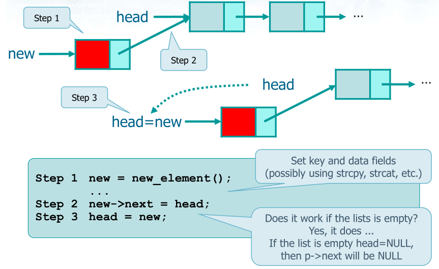
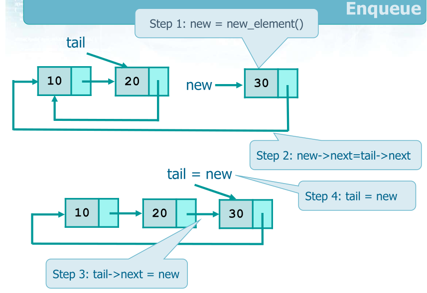
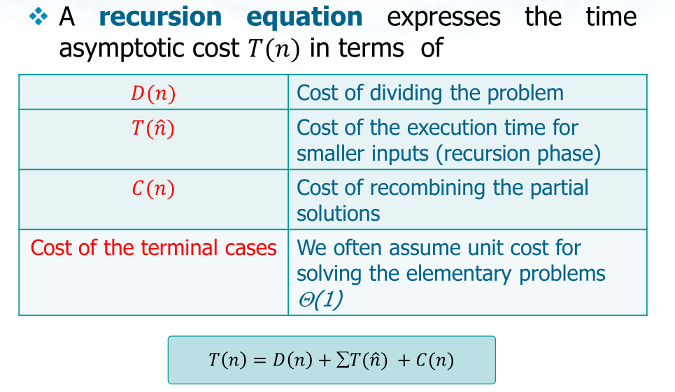

\newpage

# Pointers
```c
sizeof(char)=1
sizeof(short)
sizeof(int)= 4 (32 bit) or 8 (32bit)
sizeof(long)
sizeof(float)
sizeof(double)
sizeof(longdouble)
```

### Example in memory
```c
struct student{
  int id;
  char a;
  int id2;
  char b;
  float percentage
}
```

In memory:

. |1 byte|1 byte|1 byte|1 byte|
:-:|:-:|:-:|:-:|:-:|
id|x|x|x|x||
a|x|||||
id2|x|x|x|x||
b|x|||||
precentage|x|x|x|x||

## Pointers 
Pointers are varibles whose values are memory addresses 

- The address operator, *
  - Returns the value of the object to which its operand (i.e., a pointer) points  
  - `*p = v = 5` because it's openrand `p` points to `v`
- The indirection operator, &
  - Given a variable, it takes its address
  - Given `*p = v = 5`  `&v` is the address of `v`

```c
<type> *<pointer>;
int *pointer;
int number;

pointer = &number;
```
> This means that the pointer is equal to the number address, so pointer points to the number

### All possible cases
```c
#include <stdio.h>
#include <stdlib.h>

int main(int argc, char *argv[]) {
  int v = 5;
  int *p;
  p = &v;

  printf("%d\n", v);
  /** printf("%d\n", *v); Error!*/
  printf("%d\n", &v);
  printf("%d\n", p);
  printf("%d\n", *p);
  printf("%d\n", &p);
  printf("%d\n", *(&v));
  /** printf("%d\n", &(*v)); Error!*/
  printf("%d\n", *(&p));
  printf("%d\n", &(*p));

  return 0;
}
```
```
5
//Error!
957891628
957891628
5
957891616
5
//Error!
957891628
957891628
```

Simbol|Meaning|Outcome
:-:|:-:|:-:|
v|integer value|5
*v|meaningless|Error*!
&v|Address of v|Warning*! address 957891628
p|It is the address of v that points to v|Warning! address 957891628
*p|It's where p points. So it's the int value v|5
&p|p|Warning*! address 957891628
*(&v)|v (integer value)|5
&(*v)|meaningless|Error!
*(&p)|p|Warning*! address 957891628
&(*p)|p|Warning*! address 957891628

>*The Warning is because the print is going to print an integer ("%d") but the
>simbol is the integer address

## Final version with no Errors and no Warnings

```c
#include <stdio.h>
#include <stdlib.h>

int main(int argc, char *argv[]) {
  int v = 5;
  int *p;
  p = &v;

  printf("%d\n", v);
  printf("%lu\n", (long unsigned int) &v);
  printf("%lu\n", (long unsigned int) &v);
  printf("%lu\n", (long unsigned int) p);
  printf("%d\n", *p);
  printf("%lu\n", (long unsigned int) &p);
  printf("%d\n", *(&v));
  printf("%lu\n", (long unsigned int) *(&p));
  printf("%lu\n", (long unsigned int) &(*p));

  return 0;
}
```
Run:
```
5
140735223946540
140735223946540
140735223946540
5
140735223946528
5
140735223946540
140735223946540
```

Simbol|Meaning|Outcome
:-:|:-:|:-:|
v|integer value|5
&v|Address of v|Address 140735223946540
p|It is the address of v that points to v|Address 140735223946540
*p|It's where p points. So it's the int value v|5
&p|p|Address 140735223946540
*(&v)|v (integer value)|5
*(&p)|p|Address 140735223946540
&(*p)|p|Address 140735223946540


> `p` is the pointer that points to `v = 5` (`*p` means pointed by `p`) whose address is `p = &v = 140735223946540`

---
### Example
```c
#include <stdio.h>
#include <stdlib.h>

int main(int argc, char *argv[]) {
  float *ptr;
  float f = 7.5;

  int *ppp;
  int a = 3;

  ptr = &f;
  ppp = &a;

  printf("%.2f\n%.2f\n", f, *ptr); 
  printf("%d\n%d\n%d\n", &a, &(*ppp), ppp); 

  return 0;
}
```
Run:
```
7.5
7.5
32324325525
32324325525
32324325525
```

#### void pointer
```c
int i, j;
void *pv;
 ...
pv = &i;
 ...
j = *pv;
```

```
j = i;
```
```c
int i, j;
void *pv;
 ...
pv = (void *) &i;
 ...
j = (int) *pv;
```

```
j = i;
```
## Pointer Arithmetic
```c
int i = 10;
int *p1;
int *p2;

p1 = &i;
p1++;
```
`p++` makes the pointer points to next < type >, basically if int p++ means
next byte, if char, next bit...

```C
int i = 10;
int j = 20;
int *p1;
int *p2;
p1 = &i;
p2 = &j;
if (*p1 == *p2) { *1... }
if (p1 == p2) { *2... }
if (p1 > p2) { *3... }
```
- *1 Check whether the referenced values are the
same even if they are placed in different
position within the system memory

- *2 Check whether the two pointers
refer to the same object, i.e., they
store the same memory address

- *3 Check whether the address p1 comes
after the address p2 into the system
memory; this is often meaningless
If p1==p2 also *p1==*p2

## By reference

### Wrong

```c
int i; j;

swap (i, j);
```
Here you change them locally only

```c
void swap (int x, int y) {
  int tmp;
  
  tmp = x;
  x = y;
  y = tmp;

  return;
}
```
### Correct

you pass the pointer &i which is then pointed by x
```c
int i; j;

swap (&i, &j);
```
Here you pass the address
```c
void swap (int *x, int *y) {
  int tmp;
  
  tmp = *x;
  *x = *y;
  *y = tmp;

  return;
}
```

### Pointers and arrays

```c
int v[N];

v = &v[0]
v+i = &v[i]

*v = v[0]
*(v+i) = v[i]
```

```c
#define L ...

int v[L];
int *p;

p = v;
p = &v[0];

//1
for (i=0; i<L; i++) {
  scanf ("%d", &v[i]);
  printf ("%d", v[i]);
}

//2
for (i=0, p=v; i<L; i++, p++) {
  scanf ("%d", p);
  printf ("%d", *p);
}

//3
p = &v[0];
for (i=0; i<L; i++) {
  scanf ("%d", (p+i));
  printf ("%d", *(p+i));
}
```
### Pointers and strings
The last element is ‘\0’

```c
int strlen (char str[]) {
  int cnt;
  cnt =0;
  while (str[cnt] != '\0’)
    cnt++;
  return cnt;
}
```
 
```c
int strlen (char str[]) {
  int cnt;
  char *p;
  cnt =0;
  p = &s[0];
  while (*p != '\0’) {
    cnt++;
    p++;
  }
  return cnt;
}
```

```c
int strlen (char *str) {
  int cnt;
  cnt = 0;
  while (*str != '\0’) {
    cnt++;
    str++;
  }
  return cnt;
}
```

```c
int strlen (char *str) {
  char *p;
  p = str;
  while (*p != '\0’) {
    p++;
  }
  return (p - str);
}
```

### Pointers and structures

```c
pointer_to_structure->member_name
(*pointer_to_structure).member_name
```

```c
struct student {
  char s1[L], s2[L];
  int i;
  float f;
};
```
```c
struct student v;
 ...
read (&v);
 ...
```
```c
void read (struct student *v) {
  char s1[DIM], s2[DIM];
  int i; float f;

  fprintf (stdout, “...: ");
  scanf ("%s%s%d%d", s1, s2, &i, &f);

  strcpy (v->s1, s1);
  strcpy (v->s2, s2);

  v->i = i;
  v->f = f;

  return;
}
```
```c
struct student {
  char s1[L], s2[L];
  int i;
  float f;
};
```
```c
struct student v;
 ...
read (&v);
 ...
```
```c
void read (struct student *v) {
  char s1[DIM], s2[DIM];
  int i; float f;

  fprintf (stdout, “...: ");
  scanf ("%s%s%d%d", v->s1, v->s2, &v->i, &v->f);

  return;
}
```
\newpage

# Dinamic Memory Allocation 

<!-- ### Dinaminc memory allocation -->

there was a cool way to go there if only i would have like to

## 2D array 

Two-dimensional arrays can be allocated in two
different ways
- As a single 1D array including all elements
  - Easy syntax for allocation and manipulation
  - Difficult manipulation logic
- As an array of pointers to 1D arrays of elements
  - Difficult syntax for allocation and manipulation
  - Standard manipulation logic


you start with one array allocation

```c
int **mat;

mat = (int **) malloc(r * sizeof(int *));
  if (mat==NULL)
  {
    fprintf(stderr, "memory allocation error.\n");
    exit(1);
  }

  printf("number of columns: ");
  scanf("%d", &c);
  //allocate memory for columns
  for (i=0; i<r; i++)
  {   
    mat[i] = /*(int *)*/ malloc(c * sizeof(int)); //as always (int **) can be avoided. 
    if (mat==NULL)
    {
      fprintf(stderr, "memory allocation error.\n");
      exit(2);
    }
  }
```
It has 2 ** beacause 
```c
mat[i] = (int **) malloc (r * sizeof (int*));
```

 {width=50%}

- mat[i][j] or (mat[i])[j]
  - Indicates a single element
  - It is a value
- mat[i]
  - Indicates an entire row
  - It is a pointer to an array of values
- mat
  - Indicates the entire matrix
  - It is a pointer to an array of pointers

   {width=50%}

  mat = &mat[0]; //same notaion as p = &v;

  #### matrix scanf
  cool way to do it with strlen
```c
  int r, c, i;
  char **mat;

  printf ("Number of rows: ");
  scanf ("%d", &r);

  mat = (int **) malloc (r * sizeof (int *));
  if (mat == NULL) {
    fprintf (stderr, "Memory allocation error.\n");
    exit (1);
  }
  for (i=0; i<r; i++) {
    scanf (“%s”, str);

    mat[i] = malloc ((strlen(str)+1) * sizeof (char));
    if (mat[i] == NULL) {
      fprintf (stderr, "Memory allocation error.\n");
      exit (1);
    }
  }
```

{width=70%}  

- As for 1D arrays, also 2D arrays may be made
visible outside the environment in which they
have been allocated
- As for 1D arrays, it is possible to
  - Use global variables to contain the matrix pointer
  - Adopt the return statement to return it
  - Pass the pointer to the matrix by reference
    - Unfortunately, the pointer to the matrix is already a
    2-star object (indirect reference)
    - To pass it by reference, we have to use a 3-star
    object (a reference to a reference of a reference)

### Mtrix allocation in a function

mat dies when function dies, but the content return
```c
char **mat;
  ...
mat = malloc2d (nr, nc);
```
```c
char **malloc2d (int r, int c) {
  int i;
  char **mat;

  mat = (char **) malloc (r * sizeof(char *));
  if (mat == NULL) { ... }
  for (i=0; i<r; i++) {
    mat[i] = (char *) malloc(c * sizeof (char));
    if (mat[i]==NULL) { ... }
  }
  return (mat);
}
```
second way  
here you pass the address and the content remains there

```c
char **mat;
  ...
malloc2d (&mat, nr, nc);
```
We use a 3-* object with a temporary 2* object as a support
```c
void malloc2d (char ***m, int r, int c) {
  int i;
  char **mat;

  mat = (char **) malloc (r * sizeof(char *));
  if (mat == NULL) { ... }
  for (i=0; i<r; i++) {
  mat[i] = (char *) malloc(c * sizeof (char));
  if (mat[i]==NULL) { ... }
  }
  *m = mat;
  return;
}
```
another way
```c
char **mat;
  ...
malloc2d (&mat, nr, nc);
```
```c
void malloc2d (char ***m, int r, int c) {
  int i;

  (*m) = (char **) malloc (r * sizeof(char *));
  if (m == NULL) { ... }
  for (i=0; i<r; i++) {
    (*m)[i] = (char *) malloc(c * sizeof (char));
    if ((*m)[i]==NULL) { ... }
    }
  return;
}
```

### Free

```c
void free2d (char **m, int r) {
  int i;
  for (i=0; i<r; i++) {
    free (m[i]);
  }
  free (m);
  return;
}
```
```c
void free2d (char ***m, int r) {
}
  int **mat, i;
  mat = *m;
  for (i=0; i<r; i++) {
    free (mat[i]);
  }
  free (mat);
  m = NULL;
  return;
}
```
\newpage

# List  

## Intro   
   
   
Easy to delete and add in ahead, in the middle, in the tail   
  - FIFO or Stack   
  - LIFO   
  - Ordered List   
  - Single-Linked List   
  - Double-Linked List   
  - List of List   
   
## Prototypes (Atomic operation)   

### Struct of a List   

```c   
#include <stdio.h>   
#include <stdlib.h>   
#include <ctype.h>   
   
/* structure declaration */   
typedef struct node_s {   
  int val;   
  struct node_s *next;   
} node_t;   
```   

## Function required to operate with list   

```c   
/* function prototypes */   
int read (void);   
node_t *insert (node_t *head, int val);   
void search (node_t *head, int val);   
node_t *delete_first (node_t *head);   
node_t *delete_last (node_t *head);   
node_t *delete (node_t *head, int val);   
void display (node_t *head);   
```   

## Main   

```c   
/*    
 *  main program   
 */   
int main(void) {   
  node_t *head=NULL;   
  int val, stop=0;   
  char choice;   
   
  while (stop == 0) {   
    fprintf(stdout, "\nAvailable commands:\n");   
    fprintf(stdout, "  i: insert a value (sorted)\n");   
    fprintf(stdout, "  s: search a value\n");   
    fprintf(stdout, "  f: delete the first value\n");   
    fprintf(stdout, "  l: delete the last value\n");   
    fprintf(stdout, "  d: delete a specified value\n");   
    fprintf(stdout, "  c: display the list contents\n");   
    fprintf(stdout, "  e: end program\n");   
    fprintf(stdout, "Make your choice: ");   
    scanf("%c%*c", &choice);   
   
    switch (choice) {   
      case 'i': val = read();   
                head = insert(head, val);   
                break;   
      case 's': val = read();   
                search(head, val);   
                break;    
      case 'f': head = delete_first(head);   
                break;   
      case 'l': head = delete_last(head);   
                break;   
      case 'd': val = read();   
                head = delete(head, val);   
                break;   
      case 'c': display(head);   
                break;   
      case 'e': fprintf(stdout, "End of session.\n");   
                stop = 1;   
                break;   
      default : fprintf(stdout, "Wrong choice!\n");   
                break;   
    }   
  }   
   
  return EXIT_SUCCESS;   
}   
   
/*   
 *  read in a value   
 */   
int read (void) {   
  int val;   
   
  fprintf(stdout, "Value: ");   
  scanf("%d%*c", &val);   
   
  return val;   
}   
```   

## List insertion   

**Assigning a new value ```val``` to the ```p``` element in order to insert that element in the list**     
**Malloc the struct**     

{width=70%}  


### List visit     

{width=70%}  

```c   
/*   
 *  insert a value in the list (sorted)   
 */   
node_t *insert (node_t *head, int val) {   
  node_t *p, *q=head;   
   
  p = (node_t *)malloc(sizeof(node_t));   
  p->val = val;   
  p->next = NULL;   
```   

### Head insertion   

`p` insertion `ahead`     
`O(n)` cost   

 {width=70%}   

```c   
   
  /* insert ahead */   
  if (head==NULL || val<head->val) {   
    p->next = head;   
    //head = p;   
    return p;   
  }   
```   
### In-order insertion   

 {width=70%}    

`new->next = p->next`     
`p->next = new`   

### Middle Tail insertion   

`p->next = val1->next`     
`val1->next = p`   

```c   
  /*    
   *  scan the list with the q pointer in order to find    
   *  the correct position where to perform the insertion   
   */   
  while (q->next!=NULL && q->next->val<val) {   
    q = q->next;   
  }   
  p->next = q->next;   
  q->next = p;   
  return head;   
}   
```   
#### Tail insertion   

`Tail insertion` is basically `middle insertion`     
`p->next = val1->next`     
`val1->next = p`     
   
`p->next = val1->next`
`val1->next = p`  
or     
`p->next = NULL`
`val1->next = p`

{width=70%}       

## List searching     

if `p->key == value` you exit and unless `p == NULL` you're good in your element of the list     

 {width=70%}     

```c   
/*   
 *  search a value in the list   
 */   
void search (node_t *head, int val) {   
  node_t *p;   
  int i;   
   
  for (p=head, i=0; p!=NULL && p->val<val; p=p->next, i++) ;   
   
  if (p!=NULL && p->val==val) {   
    fprintf(stderr, "Element found (index = %d)\n", i);   
  } else {   
    fprintf(stderr, "Element NOT found.\n");   
  }   
}   
```   
   
## List extraction   

than you free `p`   

 {width=70%}    

`p = head`     
`head = head->next`     
if there's only one element     
`p = head`     
`head = NULL`   
   
### In-order Extraction   

`p = q->next`     
`q->next = p->next`     
or     
`q->next = q->next->next`     
   
`p` is only not to lose forever that element (red one), without step 1 I lose reference to elements and at the end ov the program I have many leaks. If I lose the reference I can not free it.   

 {width=70%}    
   
## List deletion (Free)   

### Free the entire list   

{width=70%}     

```c   
while (head !=0){   
  p = head;   
  head = head->next;   
  free (p);   
}   
```   

### Deleting first element   

```c   
/*   
 *  delete the first element of the list   
 */   
node_t *delete_first (node_t *head) {   
  node_t *p;   
   
  /* empty list */   
  if (head != NULL) {   
    p = head->next;   
    free(head);   
    return p;   
  }   
   
  return head;   
}   
```   

### Deleting a particular element   

```c   
/*   
 *  delete a list element, keeping it sorted   
 */   
node_t *delete_last (node_t *head) {   
  node_t *p, *q=head;   
   
  /* empty list */   
  if (head == NULL) {   
    fprintf(stderr, "Error: empty list\n");   
    return NULL;   
  }   
   
  /* delete ahead */   
  if (head->next == NULL) {   
    free(head);   
    return NULL;   
  }   
   
  /* scan the list with the q pointer */   
  while (q->next->next!=NULL) {   
    q = q->next;   
  }   
  p = q->next;   
  q->next = NULL;   
  free(p);   
   
  return head;   
}   
   
/*   
 *  delete a list element, keeping it sorted   
 */   
node_t *delete (node_t *head, int val) {   
  node_t *p, *q=head;   
   
  /* empty list */   
  if (head == NULL) {   
    fprintf(stderr, "Error: empty list\n");   
    return NULL;   
  }   
```   

### Deleting ahead   

```c   
  /* delete ahead */   
  if (val == head->val) {   
    p = head->next;   
    free(head);   
    return p;   
  }   
```   

## Scan to find an elemet to delete it   

```c   
  /*    
   *  scan the list with the q pointer in order to find    
   *  the element to remove from the list   
   */   
  while (q->next!=NULL && q->next->val<val) {   
    q = q->next;   
  }   
  if (q->next!=NULL && q->next->val==val) {   
    p = q->next;   
    q->next = p->next;   
    free(p);   
  } else {   
    fprintf(stderr, "Element NOT found.\n");   
  }   
   
  return head;   
}   
```   

## Display list   

```c   
/*   
 *  display the list contents   
 */   
void display (node_t *head) {   
  int i=0;   
   
  while (head != NULL) {   
    fprintf(stderr, "Element %d = %d\n", i++, head->val);   
    head = head->next;   
  }   
}   
```   
   
## Sentinel   

You don't check for `null`   

 {width=70%}    

 {width=70%}    

```c   
sentinel->key = value;   
p = head;   
while (value!=p->key) {   
  p = p->next;   
}   
if (p!=sentinel) {   
  ...   
value found   
} else {   
  ...   
}   
```   
   
## OT Circular buffer   
   
in a cicle   
`(i++)/%`     
so you reuse the array instead of use a matrix     
  
## FIFO  
  
### Enqueue  

{width=70%}  

{width=70%}  

### Dequeue  

{width=70%}  

```c
list_t *dequeue (list_t *tail, int *val, int *status) {
list_t *old;
if (tail != NULL) {
  if (tail == tail->next) {
    *val = tail->key;
    free (tail);
    tail
    10
    tail = NULL;
    } else {
    old = tail->next;
    *val = old->key;
    tail
    X
    tail->next = old->next;
    free (old);
    }
  } else {
  *status = FAILURE;
  }
return (tail);
}
```

## Ordered Linked Lists  

```c  
do {  
  ...  
head = insert (head, val);  
  ...  
search (head, val);  
  ...  
head = extract (head, val);  
} while ( ... );  
```  

  
```c  
list_t *dequeue (list_t *tail, int *val, int *status) {  
  list_t *old;  
  if (tail != NULL) {  
    *status = SUCCESS;  
    the self-loop) must be  
      if (tail == tail->next) {  
        implemented aside  
          *val = tail->key;  
        free (tail);  
        tail  
          10  
          tail = NULL;  
      } else {  
        old = tail->next;  
        *val = old->key;  
        tail  
          X  
          tail->next = old->next;  
        free (old);  
      }  
  } else {  
    *status = FAILURE;  
  }  
  return (tail);  
}  
```  

#### search  

{width=70%}  

**linear cosst, not logaritmic, so, don't use at the examination**  

A search can terminate
- Successfully, when we find the key
- Unsuccessfully when a record with a key larger (or
smaller) than the search key is found
- In any case
- We can stop the search as soon as the key we are
looking for become larger than the current node’s
key
- This make the search more efficient
- Nevertheless, the search still has a linear cost (O(n))
in the number of elements stored into the list

```c
void search (list_t *head, int val) {
  list_t *p;
  p=head;
  while (p!=NULL) {
    if (p->val=val)
      return p;
      if (p->val<val)
      p=p->next;
    }
  }
  return (NULL);
```

The are several approaches to solve the problem
- Use two pointers to individuate two consecutive
elements
  - Move them along the list is a synchronized way
  - Use the rightmost to compare and the leftmost to  insert
- Use a the pointer of the pointed element to make
the comparison
  - Reach the element referenced by the pointed   element to compare, use the direct pointer to insert

#### insert


{width=70%}  

{width=70%}  

{width=70%}  

```c
list_t *insert (list_t *head, int val) {
  list_t *p, *q=head;

  //Create a new element
  p = new_element ();
  p->val = val;
  p->next = NULL;

  Head insertion
  if (head==NULL || val<head->val) {
    p->next = head;
    return p;
  }
  while (q->next!=NULL && q->next->val<val) {
    q = q->next;
  }
  return head;
}
```

#### Extraction

```c
list_t *extract (list_t *head, int val) {
  list_t *p, *q=head;
  if (head == NULL) {
    fprintf(stderr, "Error: empty list\n");
    return NULL;
  }
  if (val == head->val) {
    p = head->next;
    free(head);
    Head extraction
    return p;
  }
  while (q->next!=NULL && q->next->val<val) {
    q = q->next;
  }
}
```

{width=70%}  
  
#### Double linked list  

\newpage

{width=70%}  

#### List of List  

{width=70%}  

#### Example

{width=70%}

you can extract from head1 and you insert in head2 lifo? with a head insertion

solution  

{width=70%}

```c
p = head1;
while (p != NULL){
  //p->val (p->key)
  head2 = push (head2, p->val);
  p = p->next;
}
```

{width=70%} 

Head extrction and in order insertion

\newpage

# Sorting Algorithms

## Insertion Sort

> O(n^2)  
Vector divided in left sorted and right unsorted, when there is a number higher in the left compared to another on the right they are switched

|  0  |  1  |  2	|  3  |  4  |  5	|
| --- | --- | --- | --- | --- | --- |
|  4  |  2  |  6	|  3  |  1  |  5	|
|  4  | (2) |  6	|  3  |  1  |  5	|
|  2  |  4  |  6	|  3  |  1  |  5	|
|  2  |  4  | (6) |  3  |  1  |  5	|
|  2  |  4  |  6	|  3  |  1  |  5	|
|  2  |  4  |  6	| (3) |  1  |  5	|
|  2  |  3  |  4	|  6  |  1  |  5	|
|  2  |  3  |  4	|  6  | (1) |  5	|
|  1  |  2  |  3	|  4  |  6  | (5) |
|  1  |  2  |  3	|  4  |  5  |  6	|

```c
//2 subarray
//left is sorted, right not sorted     i=1 means
//that the only sorted is in position 0.

#include <stdio.h>

void InsertionSort (int *A, int n);

int main(int argc, char *argv[]) {
  int n = 5;
  int arr[5] = {3, 8, 1, 7, 4};

  InsertionSort(arr, n);
  for(int i=0; i<n; i++){
    printf("%d ", arr[i]);
  }
  return 0;
}

void InsertionSort (int *A, int n) {
	int i, j, x;
	
	for (i=1; i<n; i++) {
		x = A[i];//first unsorted number
		j = i - 1;//J=0: only sorted number
		
		while (j>=0 && x<A[j]) {
			A[j+1] = A[j];//A[j] is not the smallest so it
			j--;//j=-1  // has to let the other go to left ex A[j+1=1]
		}

		A[j+1] = x;//A[j+1=0]
	}
}
```
\newpage

## Exchange Sort

> O(n^2)  
Vector divided in left unsorted and right sorted,  swap of any numbers with a smaller one on its right


|  0  |  1  |  2	|  3  |  4  |  5	|
| --- | --- | --- | --- | --- | --- |
|  4  |  2  |  6	|  3  |  1  |  5	|
|  2  |  4  |  3	|  1  |  5  |  [6]	|
|  2  |  4  |  3	|  1  |  [5  |  6]	|
|  2  |  1  |  3	|  4  |  [5  |  6]	|
|  2  |  1  |  3	|  [4  |  5  |  6]	|
|  2  |  1  |  [3	|  4  |  5  |  6]	|
|  [1  |  2  |  3	|  4  |  5  |  6]	|

```c
//2 subarray.
//left is unssorted, right is empty     i<n-1 means that you assume
void BubbleSort (int A[], int n) {  //  at the beginning the last is
  int i, j, temp;                   //  the greater.

  for (i=0; i<n-1; i++) {
    for (j=0; j<n-i-1; j++){        //j<n-1-i because the more you
      if (A[j] > A[j+1]) {          // go on, less numbers you have left  
        temp = A[j];
        A[j] = A[j+1];
        A[j+1] = temp;
      }//in this for you find the greater unsorted
    }  //number and swapping it, you put it on the right
  }

  return;
}
```
\newpage

## Selection Sort

> O(n^2)  
Vector divided in left sorted and right unsorted, the algorithm looks for the smallest number in the right unsorted array and swaps it wiht the first element of the unsorted array 

|  0  |  1  |  2	|  3  |  4  |  5	|
| --- | --- | --- | --- | --- | --- |
| ](4) |  2  |  6	|  3  |  (1)|  5	|
|  [1]  |  (2)|  6	|  3  |  4  |  5	|
|  [1  |  2]  |  (6)	|  (3)  |  4  |  5	|
|  [1  |  2  |  3]	|  (6)  |  (4)  |  5	|
|  [1  |  2  |  3	|  4]  |  (6)  |  (5)	|
|  [1  |  2  |  3	|  4  |  5  |  6]	|

```c
void SelectionSort (int A[], int n) {
	int i, j, min, temp;
	
	for (i=0; i<n-1; i++) {
		min = i;//first # is min
		
		for (j=i+1; j<n; j++) {   //it finds the smallest on the line 
			if (A[j] < A[min]) {    //if the first on the right (A[j]) of the min num (A[min]) is less           
				min = j;              //in that position there's the new smallest one
			}
		}                         //after this for you know which number is
                              //the smallest of the line 
		                          //end now you swap it with the one you
		temp = A[i];              //assume to be the smallest (min=i  line 7)  
		A[i] = A[min];
		A[min] = temp;
	}

  return;
}
```
\newpage

## Shell Sort

> O(n^2)  
swap numbers at same index in different arrays with insertion sort

|   0  |  1  |  2	|  3  |   4  |  5	|  6  |  7   |   8	|  9  |  10  |  11   |   12 |  13  |  14  |  15  |   16 |  17  |  18 	 |  h  |
| ---  | --- | ---| --- | ---  |--- | --- | ---  |---   | --- | ---  | ---   |---   |---   |---   |---   |---   | ---  | ---   | --- |
|7     |   6 |  8 | 9   |  8   |  6 |  2  |  1   |   8  |  7  |   0  | 4     |   5  |    3 |   0  |   1  |   0  |   4  |   9   |     |
| ---  | --- | ---| --- | ---  |--- | --- | ---  |---   | --- | ---  | ---   |---   |---   |---   |---   |---   | ---  | ---   | --- |
|  [3  |  0  |  1	|  0  |   4  |  6	|  2  |  1   |   5	|  7  |  3   |  4    |  5]  | [7   |  6 	|   8  |   9  |  8	 |  9]   |     |
|  [I  |  II | III| IV  |   V  | VI | VII | VIII |  IX  |  X  |  XI  |  XII  | XIII]| [I   |  II  |  III |  IV  |   V  |  VI]  | 13  |
| ---  | --- | ---| --- | ---  |--- | --- | ---  |---   | --- | ---  | ---   |---   |---   |---   |---   |---   | ---  | ---   | --- |
|  [3  |  0  |  0	|  0] |  [4  |  6	|  1  |  1]  |  [5	|  7  |  2   |  4]   | [8   |  7   |  6 	|   8] |  [9  |  8	 |  9]   |     |
|  [I  |  II | III| IV] |  [I  | II | III |  IV] |  [I  |  II | III  |  IV]  |  [I  |  II  | III  |  IV] |  [I  |  II  | III]  |  4  |  
| ---  | --- | ---| --- | ---  |--- | --- | ---  |---   | --- | ---  | ---   |---   |---   |---   |---   |---   | ---  | ---   | --- |
|   0  |  0  |  0	|  1  |   4  |  6	|  1  |  1   |   5	|  7  |  2   |  4    |  8   |  7   |  6 	|   8  |   9  |  8	 |  9    |  1  |


```c
void ShellSort (int A[], int n) {
	int i, j, x, h;
	h=1;

	while (h < n/3)
		h = 3*h+1;

	while (h >= 1) {
		for (i=h; i<n; i++) {
			x = A[i];
			j = i - h;

			while (j>=0 && x<A[j]) {
				A[j+h] = A[j];
				j -= h;
			}
			
			A[j+h] = x;
		}

		h = h/3;
	}
}
```

\newpage

## Counting Sort

> O(n^2)  
There are multiple arrays, the given one, another with every single value that is in the previous array with in each cell has the number of times that number exist in the previous array. A third array with the cumulative number of element at each index. Another array with the previous array numbers shifted by 1 index to the right. At this point number 0 at index 0 is between position 0 and 1, 1 occurrence, number 1 at index 1 is between position 1 and 4, 3 occurrences in the last vectors, number 2 at index 2 is between position 4 and 4, 0 occurrences in the last vectors, and last number, 3 at index 3 is between position 4 and 6, 2 occurrences in the last array.  

{width=70%}

```c
#define MAX 100

void CountingSort(int A[], int n, int k) {
	int i, C[MAX], B[MAX];

	for (i=0; i<k; i++)
		C[i] = 0;

	for (i=0; i<n; i++)
		C[A[i]]++;

	for (i=1; i<k; i++)
		C[i] += C[i-1];

	for (i=n-1; i>=0; i--) 
	{
		B[C[A[i]]-1] = A[i];
		C[A[i]]--;
	}

	for (i=0; i<n; i++)
		A[i] = B[i];
}

```
\newpage

## Merge Sort

> O(log_n(n))  
It divides the array and then, when it merges back the numbers, it does it ordering them  

{width=55%}


```c
#include <stdlib.h>
#include <stdio.h>

#define max 100

int insert_array(int V[]) {
  int n, i;
  printf("How many elements?: ");
  scanf("%d", &n);

  for (i=0; i<n; i++) {
  	 printf("Element %d: ", i);
  	    scanf("%d", &V[i]);
  }
  return(n);
}

void print_array(int V[], int n) {
  int i;
  for (i=0; i<n; i++) {
    printf("%d ", V[i]);
  }
  printf("\n");
  return;
}

void merge(int a[], int p, int q, int r) {
  int i, j, k=0, b[max];
  i = p;
  j = q+1;

  while (i<=q && j<=r) {
    if (a[i]<a[j]) {
      b[k] = a[i];
      i++;
    } else {
      b[k] = a[j];
      j++;
    }
    k++;
  }
  while (i <= q) {
    b[k] = a[i];
    i++;
    k++;
  }
  while (j <= r) {
    b[k] = a[j];
    j++;
    k++;
  }
  for (k=p; k<=r; k++)
    a[k] = b[k-p];
  return;
}

void mergeSort(int a[], int p, int r) {
  int q;
  if (p < r) {
    q = (p+r)/2;
    mergeSort(a, p, q);
    mergeSort(a, q+1, r);
    merge(a, p, q, r);
  }
  return;
}

int main(void) {
  int n, V[max];
  n = insert_array(V);
  mergeSort(V, 0, n-1);
  print_array(V, n);
  return(0);
}
```
\newpage

## Quik Sort

> O(log_n(n))  
It divides the array and then, when it merges back the numbers, it does it ordering them  

{width=45%}


```c
#include<stdio.h>

void quicksort(int number[25],int first,int last){
  int i, j, pivot, temp;
  if(first<last){
    pivot=first;
    i=first;
    j=last;
    while(i<j){
      while(number[i]<=number[pivot]&&i<last)
        i++;
      while(number[j]>number[pivot])
        j--;
      if(i<j){
        temp=number[i];
        number[i]=number[j];
        number[j]=temp;
      }
    }
    temp=number[pivot];
    number[pivot]=number[j];
    number[j]=temp;
    quicksort(number,first,j-1);
    quicksort(number,j+1,last);
  }
}
int main(){
  int i, count, number[25];
  printf("Enter some elements (Max. - 25): ");
  scanf("%d",&count);
  printf("Enter %d elements: ", count);
  for(i=0;i<count;i++)
    scanf("%d",&number[i]);
  quicksort(number,0,count-1);
  printf("The Sorted Order is: ");
  for(i=0;i<count;i++)
    printf(" %d",number[i]);
  return 0;
}
```
\newpage

# Complexity equation
\newpage

# Recursion

## Complexity

{width=50%}
{width=50%}
{width=50%}
{width=50%}
<!-- {width=50%} -->
{width=50%}
{width=50%}
{width=50%}

\newpage

# Heap sort
Data and Key

```c
struct heap_s {
  Item *A;
  int heapsize;
} heap_t;
```

```
#define LEFT(i) (2*i+1)
#define RIGHT(i) (2*i+2)
#define PARENT(i) ((int)(i-1)/2)
```

```c
#define LEFT(i) (i<<1+1)
#define RIGHT(i) (i<<1+2)
#define PARENT(i) ((i-1)>>1)
```

```c
heap->A[LEFT(i)]    //is its left child
heap->A[RIGHT(i)]   //is its right child
heap->A[PARENT(i)]  //is its parentd
```
```c
heap->A[0]
```

{width=70%}  

the tree is filled in the array order

largest on top, then has to be removed 

## Implementation

```c
void heapbuild (heap_t heap) {
  int i;
  for (i=(heap->heapsize)/2-1; i >= 0; i--) {
    heapify (heap, i);
  }
  return;
}
```

```c
void heapify (heap_t heap, int i) {
  int l, r, largest;
  l = LEFT(i);
  r = RIGHT(i);
  if ((l<heap->heapsize) &&
      (item_greater (heap->A[l], heap->A[i])))
    largest = l;
  else
    largest = i;
  if ((r<heap->heapsize)&&
      (item_greater (heap->A[r], heap->A[largest])))
    largest = r;
  if (largest != i) {
    swap (heap, i, largest);
    heapify (heap, largest);
  }
  return;
}
```

```c
void heapsort (heap_t heap) {
  int i, tmp;
  heapbuild (heap);
  tmp = heap->heapsize;
  for (i=heap->heapsize-1; i>0; i--) {
    swap (heap, 0, i);
    heap->heapsize--;
    heapify (heap,0);
  }
  heap->heapsize = tmp;
  return;
}
```

\newpage

# Priority queue

> $T(n) = O(log_2 n)$

## Implementation

```c
void pq_insert (PQ pq, Item item) {
  int i;
  i = pq->heapsize++;
  while( (i>=1) &&
      (item_less(pq->A[PARENT(i)], item)) )
    pq->A[i] = pq->A[PARENT(i)];
  i = PARENT (i);
}
pq->A[i] = item;
return;
}
```

```c
Item pq_extract_max(PQ pq) {
  Item item;
  Extract max and move
    last element into the
    root node
    swap (pq, 0, pq->heapsize-1);
  item = pq->A[pq->heapsize-1];
  pq->heapsize--;
  heapify (pq, 0);
  Reduce heap size
}
return item;
```

```c
void pq_change (PQ pq, int i, Item item) {
  if (item_less (item, pq->A[i]) {
    decrease_key (pq, i);
  } else {
    increase_key (pq, i, item);
  }
}

void decrease_key (PQ pq, int i) {
  pq->A[i] = item;
  heapify (pq, i);
}

void increase_key (PQ pq, int i) {
  while( (i>=1) &&
      (item_less(pq->A[PARENT(i)], item)) ) {
    pq->A[i] = pq->A[PARENT(i)];
    i = PARENT(i);
  }
  pq->A[i] = item;
}
```
\newpage

# Binary Search Tree

{width=70%}

## Implementation

```c
void writeTree(FILE *fp, node_t *rp, int modo) {
  if (rp == NULL) {
    return;
  }

  if (modo == PREORDER) {
    writeData(fp, rp->data);
  }

  writeTree(fp, rp->left, modo);

  if (modo == INORDER) {
    writeData(fp, rp->data);
  }

  writeTree(fp, rp->right, modo);

  if (modo == POSTORDER) {
    writeData(fp, rp->data);
  }

  return;
}

```
\newpage

# Hash tables

<!-- # Hash table -->
## Linear chaining

h'(k) = k % M

## Open address

N << M -> Load Factor = alpha = N / M

## Linear Probing

h'(k) = (h(k)+i) % M

## quadratic Probing

h'(k) = (h(k)+ c_1 * i + c_2 * i^2) % M

## double hasing

h'(k) = (h_1(k)+ i * h_2(k) ) % M

## linear probing
### example

```
A S E R C H I N G X M P

a b c d e f g h i j  k  l  m  n  o  p  q  r  s  t  u  v  w  x  y  z  
1 2 3 4 5 6 7 8 9 10 11 12 13 14 15 16 17 18 19 20 21 22 23 24 25 26  
1 2 3 4 5 6 7 8 9 10 11 12  0  1  2  3  4  5  6  7  8  9 10 11 12  0   


h'(k) = k % M = k % 13  
h'(k) = (k % 13 + i) % 13  

0 1 2 3 4 5 6 7 8 9 10 11 12  
n a   c   e s r h i            
```
\newpage

## quadratic probing
### example
```
A S E R C H I N G X M P  

a b c d e f g h i j  k  l  m  n  o  p  q  r  s  t  u  v  w  x  y  z  
1 2 3 4 5 6 7 8 9 10 11 12 13 14 15 16 17 18 19 20 21 22 23 24 25 26   
1 2 3 4 5 6 7 8 9 10 11 12  0  1  2  3  4  5  6  7  8  9 10 11 12  0   


    h'(k) = (h_1(k)+ i * h_2(k) ) % M  
->  h'(k) = (h(k)+ c_1 * i + c_2 * i^2) % M  

0 1 2 3 4 5 6 7 8 9 10 11 12  
  a   c   e s   r             
```

# Greedy
> Finding every solution is expensive

At each step you look for the best

It doesn't backtrack

## Cost function

* selected a priorit
  - start from empty solution
  - sort it
  - choice
* modifyiable during the process
  - choice stored in priority queue

{width=70%}

```c
typedef struct activity {
  char name[MAX];
  int start, stop;
  int selected;
} activity_t;
  ...
int cmp (const void *p1, const void *p2);
  ...
acts = load(argv[1], &n);
qsort ((void *)acts, n, sizeof(activity_t), cmp);
choose (acts, n);
display (acts, n);
  ...

  int cmp (const void *p1, const
      activity_t *a1 = (activity_t
        activity_t *a2 = (activity_t
          return a1->stop - a2->stop;
          }
          void choose (activity_t *acts,
            int i, stop;
            }
            void *p2) {
          *)p1;
        *)p2;
      int n) {
    acts[0].selected = 1;
    stop = acts[0].stop;
    for (i=1; i<n; i++) {
      if (acts[i].start >= stop) {
        acts[i].selected = 1;
        stop = acts[i].stop;
      }
    }
```

images tree...

```c
{
  PQ *pq;
  pq = pq_init (maxN, item_compare);
  for (i=0; i<maxN; i++) {
    printf ("Enter letter & frequency: ");
    scanf ("%s %d", &letter, &freq);
    tmp = item_new (letter, freq);
    pq_insert (pq, tmp);
  }

  while (pq_size(pq) > 1) {
    l = pq_extract_max (pq);
    r = pq_extract_max (pq);
    tmp = item_new ('!', l->freq + r->freq);
    tmp->left = l;
    tmp->right = r;
    pq_insert (pq, tmp);
  }
  root = pq_extract_max (pq);
  pq_display (root, code, 0);
}
```

Complexity

$$ T(n) = O(n * log_2 n) $$

\newpage

# Graphs
Definition
  - G = (V, E)
  - V = Finite and non empty set of vertices (simple or complex data)
  - E = Finite set of edges, that define a binary relation on V

- Directed/Undirected graphs

- Directed
  - Edge = sorted pair of vertices (u, v) E and u, v  V
- Undirected
  - Edge = unsorted pair of vertices (u, v) E and u, v  V
- Weighted
  - each edge has a weight

### Loops
- A loop is defined as a path where
  - v 0 =v k , the starting and arrival vertices do coincide
- Self-loop
  - Loops whose length is 1
- A graphs without loops is called
- acyclic

\newpage

# Graphs visit
## Breadth-First Search (BFS)

```c
BFS (G, s)
  for each vertex v in V
    v.color = WHITE
    v.dtime = inf
    v.pred = NULL

  queue_init (Q)
  s.color = GRAY
  s.dtime = 0
  s.pred = NULL
  queue_enqueue (Q, s)

  while (!queue_empty (Q))
    u = queue_dequeue (Q)
    for each v in Adj(u)
      if (v.color == WHITE)
        vertex
        v.color = GRAY
        v.dtime = u.dtime + 1
        v.pred = u
        queue_enqueue (Q, v)

    u.color = BLACK
```

{width=70%}

{width=70%}

\newpage

```c
g = graph_load(argv[1]);
printf("Initial vertex? ");
scanf("%d", &i);
src = graph_find(g, i);

graph_attribute_init (g);
graph_bfs (g, src);

n = g->g;
printf ("List of vertices:\n");
while (n != NULL) {
  if (n->color != WHITE) {
    printf("%2d: %d (%d)\n",
        n->id, n->dist, n->pred ? n->pred->id : -1);
  }
  n = n->next;
}
graph_dispose(g);

void graph_bfs (graph_t *g, vertex_t *n) {
  queue_t *qp;
  vertex_t *d;
  edge_t *e;
  qp = queue_init (g->nv);
  n->color = GREY;
  n->dist = 0;
  n->pred = NULL;
  queue_put (qp, (void *)n);

  while (!queue_empty_m(qp)) {
    queue_get(qp, (void **)&n);
    e = n->head;
    while (e != NULL) {
      d = e->dst;
      if (d->color == WHITE) {
        d->color = GREY;
        d->dist = n->dist + 1;
        d->pred = n;
        queue_put (qp, (void *)d);
      }
      e = e->next;
    }
    n->color = BLACK;
  }
  queue_dispose (qp, NULL);
}
```
\newpage

## Depth-First Search (DFS)

```c
DFS (G)
for each vertex v in V
v.color = WHITE
v.dtime = v.endtime = inf
v.pred = NULL
time = 0
for each vertex v in V
if (v.color = WHITE)
DFS_r (G, v)
DFS_r (G, u)
time++
u.dtime = time
u.color = GRAY
for each v in Adj(u)
if (v.color == WHITE)
v.pred = u
DFS_r (G, v)
u.color = BLACK
time++
u.endtime = time
```

{width=70%}  

{width=70%}  

\newpage

```c
g = graph_load (argv[1]);
printf ("Initial vertex? ");
scanf ("%d", &i);
src = graph_find (g, i);
graph_attribute_init (g);
graph_dfs (g, src);
graph_dispose (g);

void graph_dfs (graph_t *g, vertex_t *n) {
  int currTime=0;
  vertex_t *tmp, *tmp2;
  printf("List of edges:\n");
  currTime = graph_dfs_r (g, n, currTime);
  for (tmp=g->g; tmp!=NULL; tmp=tmp->next) {
    if (tmp->color == WHITE) {
      currTime = graph_dfs_r (g, tmp, currTime);
    }
  }
  printf("List of vertices:\n");
  for (tmp=g->g; tmp!=NULL; tmp=tmp->next) {
    tmp2 = tmp->pred;
    printf("%2d: %2d/%2d (%d)\n",
        tmp->id, tmp->disc_time, tmp->endp_time,
        (tmp2!=NULL) ? tmp->pred->id : -1);
  }
}

int graph_dfs_r(graph_t *g, vertex_t *n, int currTime) {
  edge_t *e;
  vertex_t *t;
  n->color = GREY;
  n->disc_time = ++currTime;
  e = n->head;
  while (e != NULL) {
    t = e->dst;
    switch (tmp->color) {
      case WHITE: printf("%d -> %d : T\n", n->id, t->id);
                  break;
      case GREY : printf("%d -> %d : B\n", n->id, t->id);
                  break;
      case BLACK:
                  if (n->disc_time < t->disc_time) {
                    printf("%d -> %d : F\n",n->disc_time,t->disc_time);
                  } else {
                    printf("%d -> %d : C\n", n->id, t->id);
                  }
    }
    if (tmp->color == WHITE) {
      tmp->pred = n;
      currTime = graph_dfs_r (g, tmp, currTime);
    }
    e = e->next;
  }
  n->color = BLACK;
  n->endp_time = ++currTime;
  return currTime;
}
```

\newpage

# Libraries

## List library 

### Stack

```c
#ifndef _STACK_PUBLIC
#define _STACK_PUBLIC

#include <stdio.h>

/* macro definition */
#define stack_empty_m(sp) (stack_count(sp) == 0)

/* type declarations */
typedef struct stack stack_t;

/* extern function prototypes */
extern stack_t *stack_init(int size);
extern int stack_count(stack_t *sp);
extern int stack_push(stack_t *sp, void *data);
extern int stack_pop(stack_t *sp, void **data_ptr);
extern void stack_print(FILE *fp, stack_t *sp, void (*print)(FILE *, void *));
extern void stack_dispose(stack_t *sp, void (*quit)(void *));

#endif
```


```c
#ifndef _STACK_PRIVATE
#define _STACK_PRIVATE

#include <stdio.h>
#include "stackPublic.h"
#include "util.h"

/* structure declarations */
struct stack {
  void **array;
  int index;
  int size;
};

#endi
```


```c
#include "stackPrivate.h"

/*
 *  create a new empty stack
 */
stack_t *stack_init(int size) {
  stack_t *sp;

  sp = (stack_t *)util_malloc(sizeof(stack_t));
  sp->size = size;
  sp->index = 0;
  sp->array = (void **)util_malloc(size * sizeof(void *));
  return sp;
}

/*
 *  return the number of elements stored in the stack
 */
int stack_count(stack_t *sp) { return (sp != NULL) ? sp->index : 0; }

/*
 *  store a new value in the stack (LIFO policy)
 */
int stack_push(stack_t *sp, void *data) {
  if (sp == NULL || sp->index >= sp->size) {
    return 0;
  }

  sp->array[sp->index++] = data;
  return 1;
}

/*
 *  extract a value from the stack (LIFO policy)
 */
int stack_pop(stack_t *sp, void **data_ptr) {
  if (sp == NULL || sp->index <= 0) {
    return 0;
  }

  *data_ptr = sp->array[--sp->index];
  return 1;
}

/*
 *  print all the stack elements (LIFO policy)
 */
void stack_print(FILE *fp, stack_t *sp, void (*print)(FILE *, void *)) {
  int i;

  if (sp != NULL) {
    for (i = sp->index - 1; i >= 0; i--) {
      print(fp, sp->array[i]);
      fprintf(fp, "\n");
    }
  }
}

/*
 *  deallocate all the memory associated to the stack
 */
void stack_dispose(stack_t *sp, void (*quit)(void *)) {
  int i;

  if (sp != NULL) {
    if (quit != NULL) {
      for (i = 0; i < sp->index; i++) {
        quit(sp->array[i]);
      }
    }
    free(sp->array);
    free(sp);
  }
}
```

\newpage

### BST Library

```c
#ifndef _TREE_PUBLIC_INCLUDED
#define _TREE_PUBLIC_INCLUDED

#include "data.h"

#define PREORDER  -1
#define INORDER    0
#define POSTORDER  1

typedef struct node node_t;

data_t getData (node_t *);
node_t *createEmptyTree ();
node_t *readTree(FILE *);
node_t *searchI (node_t *, data_t);
node_t *searchR (node_t *, data_t);
node_t *treeMinI (node_t *);
node_t *treeMinR (node_t *);
node_t *treeMaxI (node_t *);
node_t *treeMaxR (node_t *);
node_t *insert(node_t *, data_t);
node_t *delete(node_t *, data_t);
void writeTree(FILE *, node_t *, int);
void freeTree(node_t *);

#endif

```

```c
#ifndef _TREE_PRIVATE_INCLUDED
#define _TREE_PRIVATE_INCLUDED

#include "treePublic.h"
// #include "treeAddition.h"

struct node {
  data_t val;
  struct node *left;
  struct node *right;
};


#endif

```

```c
#include "treePrivate.h"

#define FIND 0

static node_t *myAlloc(void);
#if FIND
static data_t findDeleteMax1(node_t **);
#endif
#if !FIND
static node_t *findDeleteMax2(data_t *, node_t *);
#endif

data_t getData(node_t *node) { return (node->val); }

node_t *createEmptyTree(void) { return (NULL); }

node_t *treeMinI(node_t *rp) {
  if (rp == NULL)
    return (rp);

  while (rp->left != NULL) {
    rp = rp->left;
  }

  return (rp);
}

node_t *treeMinR(node_t *rp) {
  if (rp == NULL || rp->left == NULL)
    return (rp);

  return (treeMinR(rp->left));
}

node_t *treeMaxI(node_t *rp) {
  if (rp == NULL)
    return (rp);

  while (rp->right != NULL) {
    rp = rp->right;
  }

  return (rp);
}

node_t *treeMaxR(node_t *rp) {
  if (rp == NULL || rp->right == NULL)
    return (rp);

  return (treeMaxR(rp->right));
}

node_t *searchI(node_t *rp, data_t data) {
  while (rp != NULL) {
    if (compare(rp->val, data) == 0)
      return (rp);

    if (compare(data, rp->val) < 0)
      rp = rp->left;
    else
      rp = rp->right;
  }

  return (NULL);
}

node_t *searchR(node_t *rp, data_t data) {
  if (rp == NULL || compare(rp->val, data) == 0)
    return (rp);

  if (compare(data, rp->val) < 0)
    return (searchR(rp->left, data));
  else
    return (searchR(rp->right, data));
}

node_t *insert(node_t *rp, data_t data) {
  node_t *p;

  /* Empty Tree: Found Position */
  if (rp == NULL) {
    p = myAlloc();
    p->val = data;
    p->left = p->right = NULL;
    return (p);
  }

  /* Duplicated Element */
  if (compare(data, rp->val) == 0) {
    return (rp);
  }

  if (compare(data, rp->val) < 0) {
    /* Insert on the left */
    rp->left = insert(rp->left, data);
  } else {
    /* Insert on the right */
    rp->right = insert(rp->right, data);
  }

  return (rp);
}

node_t *readTree(FILE *fp) {
  node_t *rp;
  data_t d;

  rp = createEmptyTree();

  while (readData(fp, &d) != EOF) {
    rp = insert(rp, d);
  }

  return (rp);
}

void freeTree(node_t *rp) {
  if (rp == NULL) {
    return;
  }

  freeTree(rp->left);
  freeTree(rp->right);
  free(rp);

  return;
}

void writeTree(FILE *fp, node_t *rp, int modo) {
  if (rp == NULL) {
    return;
  }

  if (modo == PREORDER) {
    writeData(fp, rp->val);
  }

  writeTree(fp, rp->left, modo);

  if (modo == INORDER) {
    writeData(fp, rp->val);
  }

  writeTree(fp, rp->right, modo);

  if (modo == POSTORDER) {
    writeData(fp, rp->val);
  }

  return;
}

node_t *delete (node_t *rp, data_t data) {
  node_t *p;

  /* Empty Tree */
  if (rp == NULL) {
    printf("Error: Unknown Data\n");
    return (rp);
  }

  if (compare(data, rp->val) < 0) {
    /* Delete on the left sub-treee Recursively */
    rp->left = delete (rp->left, data);
    return (rp);
  }

  if (compare(data, rp->val) > 0) {
    /* Delete on the rigth sub-treee Recursively */
    rp->right = delete (rp->right, data);
    return (rp);
  }

  /* Delete Current Note rp */
  p = rp;
  if (rp->right == NULL) {
    /* Empty Right Sub-Tree: Return Left Sub-Tree */
    rp = rp->left;
    free(p);
    return (rp);
  }

  if (rp->left == NULL) {
    /* Empty Left Sub-Tree: Return Right Sub-Tree */
    rp = rp->right;
    free(p);
    return rp;
  }

  /* Find Predecessor and Substitute */
#if FIND
  rp->val = findDeleteMax1(&(rp->left));
#endif
#if !FIND
  {
    data_t val;

    rp->left = findDeleteMax2(&val, rp->left);
    rp->val = val;
  }
#endif

  return (rp);
}

static node_t *myAlloc(void) {
  node_t *p;

  p = (node_t *)malloc(sizeof(node_t));
  if (p == NULL) {
    printf("Allocation Error.\n");
    exit(1);
  }

  return (p);
}

#if FIND
static data_t findDeleteMax1(node_t **rpp) {
  node_t *p;
  data_t d;

  /* Find The Rigth-Most Node (max value) */
  while ((*rpp)->right != NULL)
    rpp = &((*rpp)->right);

  p = *rpp;
  d = p->val;
  *rpp = (*rpp)->left;
  free(p);

  return (d);
}
#endif

#if !FIND
static node_t *findDeleteMax2(data_t *d, node_t *rp) {
  node_t *tmp;

  if (rp->right == NULL) {
    *d = rp->val;
    tmp = rp->left;
    free(rp);
    return (tmp);
  }

  rp->right = findDeleteMax2(d, rp->right);
  return (rp);
}
#endif
```

\newpage

## Item library

### Item with Stack
```c
#ifndef _ITEM
#define _ITEM

#include <stdio.h>
#include "util.h"

/* type declarations */
typedef int *item_t;

/* extern function prototypes */
extern int item_read(FILE *fp, void **ptr);
extern void item_print(FILE *fp, void *ptr);
extern int item_compare(void *data1, void *data2);
extern void item_dispose(void *ptr);

#endif
```

```c
#include "item.h"

#define MAX 100

/*
 *  read an item from file
 */
int item_read (FILE *fp, void **data_ptr) {
  int *p;

  p = (int *)util_malloc(sizeof(int));
  if (fscanf(fp, "%d", p) == EOF) {
    return EOF;
  }
  *data_ptr = p;

  return 1;
}

/*
 *  print an item on file
 */
void item_print (FILE *fp, void *ptr) {
  item_t data = (item_t)ptr;
  fprintf(fp, "%d ", *data);
}

/*
 *  compare two items 
 */
int item_compare (void *ptr1, void *ptr2) {
  item_t data1 = (item_t)ptr1;
  item_t data2 = (item_t)ptr2;

  return (*data1)-(*data2);
}

/*
 *  free an item 
 */
void item_dispose (void *ptr) {
  item_t data = (item_t)ptr;
  free(data);
  return;
}
```

### Item with BST

\newpage

## Util library

### Util with Stack

```c
#ifndef _UTIL
#define _UTIL

#include <stdio.h>
#include <stdlib.h>
#include <string.h>

/* macro definition */
#define util_check_m(expr, msg) \
  if ( !(expr) ) { \
    fprintf(stderr, "Error: %s\n", msg); \
    exit(EXIT_FAILURE); \
  }

/* extern function prototypes */
extern FILE *util_fopen(char *name, char *mode);
extern void *util_malloc(unsigned int size);
extern void *util_calloc(unsigned int num, unsigned int size);
extern char *util_strdup(char *src);
extern void util_array_dispose(void **ptr, unsigned int n, void (*quit)(void *));
extern void **util_matrix_alloc(unsigned int n, unsigned int m, unsigned int size);
extern void util_matrix_dispose(void ***ptr, unsigned int n, unsigned int m, 
                                void (*quit)(void *));
#endif
```
```c
#include "util.h"

/*
 *  fopen (with check) utility function
 */
FILE *util_fopen(char *name, char *mode) {
  FILE *fp = fopen(name, mode);
  util_check_m(fp != NULL, "could not open file!");
  return fp;
}

/*
 *  malloc (with check) utility function
 */
void *util_malloc(unsigned int size) {
  void *ptr = malloc(size);
  util_check_m(ptr != NULL, "memory allocation failed!");
  return ptr;
}

/*
 *  calloc (with check) utility function
 */
void *util_calloc(unsigned int num, unsigned int size) {
  void *ptr = calloc(num, size);
  util_check_m(ptr != NULL, "memory allocation failed!");
  return ptr;
}

/*
 *  strdup (with check) utility function
 */
char *util_strdup(char *src) {
  char *dst = strdup(src);
  util_check_m(dst != NULL, "memory allocation failed");
  return dst;
}

/*
 *  array de-allocation utility function
 */
void util_array_dispose(void **ptr, unsigned int n, void (*quit)(void *)) {
  int i;

  if (quit != NULL) {
    for (i = 0; i < n; i++) {
      quit(ptr[i]);
    }
  }
  free(ptr);
}

/*
 *  matrix allocation utility function
 */
void **util_matrix_alloc(unsigned int n, unsigned int m, unsigned int size) {
  void **ptr;
  int i;

  ptr = (void **)util_malloc(n * sizeof(void *));
  for (i = 0; i < n; i++) {
    ptr[i] = util_calloc(m, size);
  }
  return ptr;
}

/*
 *  matrix de-allocation utility function
 */
void util_matrix_dispose(void ***ptr, unsigned int n, unsigned int m,
                         void (*quit)(void *)) {
  int i, j;

  for (i = 0; i < n; i++) {
    if (quit != NULL) {
      for (j = 0; j < m; j++) {
        quit(ptr[i][j]);
      }
    }
    free(ptr[i]);
  }
  free(ptr);
}
```


### Util with BST

\newpage

## Data Library

### Data with BST

```c
#ifndef _DATA_INCLUDED
#define _DATA_INCLUDED

#include <stdio.h>
#include <stdlib.h>
#include <string.h>
#include <ctype.h>

#define MAXC 20

typedef int data_t;

int readData (FILE *, data_t *);
void writeData (FILE *, data_t);
int compare (data_t, data_t);

#endif
```

```c
#include "data.h"

int readData(FILE *fp, data_t *data) {
  int retValue;

  retValue = fscanf(fp, "%d", data);

  return (retValue);
}

void writeData(FILE *fp, data_t data) {
  fprintf(fp, "%d\n", data);

  return;
}

int compare(data_t d1, data_t d2) {
  if (d1 < d2) {
    return (-1);
  } else {
    if (d1 == d2) {
      return (0);
    } else {
      return (1);
    }
  }
}
```

\newpage

## Symbol table

```c
#ifndef ST_H_DEFINED
#define ST_H_DEFINED

#include "item.h"

typedef struct symboltable *ST;

ST  	STinit(int) ;
void 	STinsert(ST, Item) ;
Item	STsearch(ST, Key) ;
void	STdelete(ST, Key) ;
void	STdisplay(ST) ;

#endif
```


```c

#include <stdio.h>
#include <stdlib.h>
#include <string.h>

#include "item.h"
#include "st.h"

typedef struct STnode *link;

struct STnode {
  Item item;
  link next;
};

struct symboltable {
  link *heads;
  int M;
  link z;
};

link NEW(Item item, link next) {
  link x = malloc(sizeof *x);
  x->item = item;
  x->next = next;
  return x;
}

ST STinit(int maxN) {
  int i;
  ST st = malloc(sizeof *st);

  st->M = maxN;
  st->heads = malloc(st->M * sizeof(link));
  st->z = NEW(ITEMsetvoid(), NULL);

  for (i = 0; i < st->M; i++)
    st->heads[i] = st->z;

  return st;
}

int hash(Key v, int M) {
  int h = 0, base = 127;

  for (; *v != '\0'; v++)
    h = (base * h + *v) % M;

  return h;
}

int hashU(Key v, int M) {
  int h, a = 31415, b = 27183;

  for (h = 0; *v != '\0'; v++, a = a * b % (M - 1))
    h = (a * h + *v) % M;

  return h;
}

void STinsert(ST st, Item item) {
  int i;

  i = hash(KEYget(item), st->M);

  fprintf(stdout, "  hash index = %d\n", i);

  st->heads[i] = NEW(item, st->heads[i]);

  return;
}

Item searchST(link t, Key k, link z) {
  if (t == z)
    return ITEMsetvoid();

  if ((KEYcompare(KEYget(t->item), k)) == 0)
    return t->item;

  return (searchST(t->next, k, z));
}

Item STsearch(ST st, Key k) {
  return searchST(st->heads[hash(k, st->M)], k, st->z);
}

link deleteR(link x, Key k) {
  if (x == NULL)
    return NULL;

  if ((KEYcompare(KEYget(x->item), k)) == 0) {
    link t = x->next;
    free(x);
    return t;
  }

  x->next = deleteR(x->next, k);

  return x;
}

void STdelete(ST st, Key k) {
  int i = hash(k, st->M);
  st->heads[i] = deleteR(st->heads[i], k);

  return;
}

void visitR(link h, link z) {
  if (h == z)
    return;

  ITEMshow(h->item);
  visitR(h->next, z);

  return;
}

void STdisplay(ST st) {
  int i;

  for (i = 0; i < st->M; i++) {
    fprintf(stdout, "st->heads[%d]: ", i);
    visitR(st->heads[i], st->z);
    fprintf(stdout, "\n");
  }

  return;
}
```

### Item with Symbol tables

```c
#ifndef _DATO_INCLUDED
#define _DATO_INCLUDED

#define MAXST 10

typedef struct item* Item;
typedef char *Key;

Item ITEMscan();
void ITEMshow(Item data);
int ITEMcheckvoid(Item data);
Item ITEMsetvoid();
Key KEYscan();
int KEYcompare(Key k1, Key k2);
Key KEYget(Item data);
#endif
```

```c
#include <math.h>
#include <stdio.h>
#include <stdlib.h>
#include <string.h>

#include "item.h"

struct item {
  char *name;
  int value;
};

Item ITEMscan() {
  char name[MAXST];
  int value;

  scanf("%s%d", name, &value);

  Item tmp = (Item)malloc(sizeof(struct item));
  if (tmp == NULL) {
    return ITEMsetvoid();
  } else {
    tmp->name = strdup(name);
    tmp->value = value;
  }

  return tmp;
}

void ITEMshow(Item data) {
  fprintf(stdout, "   name = %s value = %d  ", data->name, data->value);
}

int ITEMcheckvoid(Item data) {
  Key k1, k2 = "";

  k1 = KEYget(data);
  if (KEYcompare(k1, k2) == 0)
    return 1;
  else
    return 0;
}

Item ITEMsetvoid() {
  char name[MAXST] = "";

  Item tmp = (Item)malloc(sizeof(struct item));
  if (tmp != NULL) {
    tmp->name = strdup(name);
    tmp->value = -1;
  }
  return tmp;
}
```


## Graphs


# Prototypes Library

## Stack

```c
/* type declarations */
typedef struct stack stack_t;

/* structure declarations */
struct stack {
  void **array;
  int index;
  int size;
};

/* extern function prototypes */
extern stack_t *stack_init(int size);
extern int stack_count(stack_t *sp);
extern int stack_push(stack_t *sp, void *data);
extern int stack_pop(stack_t *sp, void **data_ptr);
extern void stack_print(FILE *fp, stack_t *sp, void (*print)(FILE *, void *));
extern void stack_dispose(stack_t *sp, void (*quit)(void *));
```

### Item

```c
/* type declarations */
typedef struct item *item_t;

/* extern function prototypes */
extern int item_read(FILE *fp, void **ptr);
extern void item_print(FILE *fp, void *ptr);
extern int item_compare(void *data1, void *data2);
extern void item_dispose(void *ptr);
```

### Util

```c
/* macro definition */
#define util_check_m(expr, msg) \
  if ( !(expr) ) { \
    fprintf(stderr, "Error: %s\n", msg); \
    exit(EXIT_FAILURE); \
  }

/* extern function prototypes */
extern FILE *util_fopen(char *name, char *mode);
extern void *util_malloc(unsigned int size);
extern void *util_calloc(unsigned int num, unsigned int size);
extern char *util_strdup(char *src);
extern void util_array_dispose(void **ptr, unsigned int n, void (*quit)(void *));
extern void **util_matrix_alloc(unsigned int n, unsigned int m, unsigned int size);
extern void util_matrix_dispose(void ***ptr, unsigned int n, unsigned int m, 
    void (*quit)(void *));
```

## BST

```c
#define PREORDER  -1
#define INORDER    0
#define POSTORDER  1

typedef struct node node_t;

struct node {
  data_t val;
  struct node *left;
  struct node *right;
};

data_t getData (node_t *);
node_t *createEmptyTree ();
node_t *readTree(FILE *);
node_t *searchI (node_t *, data_t);
node_t *searchR (node_t *, data_t);
node_t *treeMinI (node_t *);
node_t *treeMinR (node_t *);
node_t *treeMaxI (node_t *);
node_t *treeMaxR (node_t *);
node_t *insert(node_t *, data_t);
node_t *delete(node_t *, data_t);
void writeTree(FILE *, node_t *, int);
void freeTree(node_t *);
```

```c
void countNode (node_t *root, int *array);
void countLevel (node_t * root, int *array, int l);
void countPath (node_t * root, int *np, int *length);
int visit (node_t *root, int key1, int key2);
void visit_r (node_t *root, int key, int *d);
```

### Data

```c
typedef int data_t;

int readData (FILE *, data_t *);
void writeData (FILE *, data_t);
int compare (data_t, data_t);
```

### Util

```c
void check_args(int argc, char **argv);
FILE *open_file(char *filename, char *mode);
void *malloc_ck(int size);
int file_num_of_line_completed(char *filename, char *mode);
```

## ST

```c
typedef struct symboltable *ST;

ST  	STinit(int) ;
void 	STinsert(ST, Item) ;
Item	STsearch(ST, Key) ;
void	STdelete(ST, Key) ;
void	STdisplay(ST) ;
```

### Item

```c
typedef struct item* Item;
typedef char *Key;

Item ITEMscan();
void ITEMshow(Item data);
int ITEMcheckvoid(Item data);
Item ITEMsetvoid();
Key KEYscan();
int KEYcompare(Key k1, Key k2);
Key KEYget(Item data);
```
